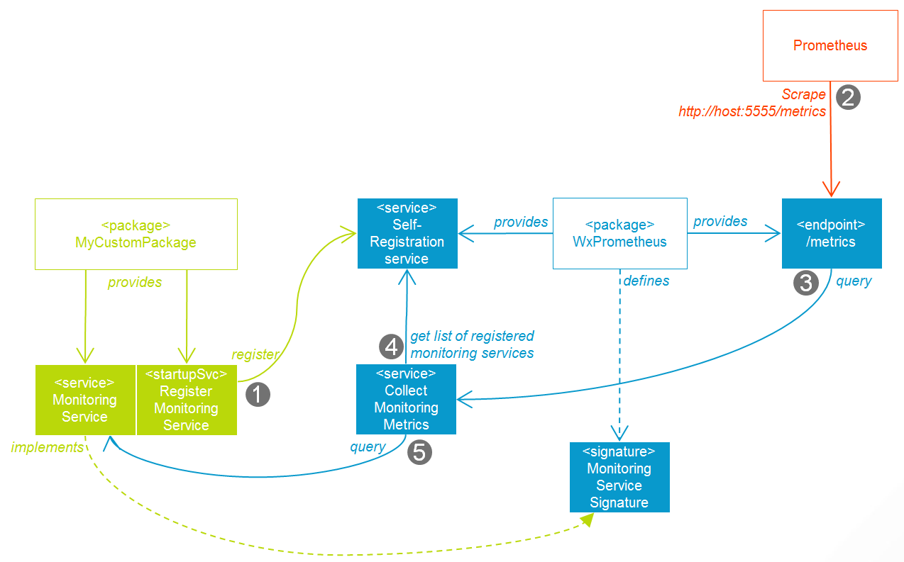

# WxPrometheus

WxPrometheus provides a scraping endpoint for the monitoring tool Prometheus into IntegrationServer. WxPrometheus offers a framework for all kinds of monitoring providers within IntegrationServer. Currently a reference implementation by WxPlatformMonitoring exists.

WxPrometheus supports the Prometheus polling/scraping model by registering the URL alias "/metrics" within IntegrationServer. Custom monitoring providers within IntegrationServer register with WxPrometheus to provide specific monitoring data in a pre-defined format.

The basic idea is to provide a self-contained monitoring service for independent (i.e. not centrally managed) IntegrationServer nodes/platforms. The architecture and process are displayed below:

The process is as follows:

1.  A custom IntegrationServer packages provides a monitoring service which implements a specific Service Specification provided by WxPrometheus. The custom package uses a startup service to register this monitoring service with WxPrometheus.
2.  Prometheus scrapes the IntegrationServer using the endpoint `/metrics`, which will return a standard text-metric.
3.  The metrics-endpoint service invokes the metric collection service.
4.  The metric collection services extracts the list of all registered monitoring services.
5.  The metric collection service then invokes all registered monitoring services and creates the text metric from all responses, which is then returned to Prometheus.

## Related Work

Note, this packages provides only functionality for the Prometheus protocol. You should install following related packages to collect metrics ...

* [WxPlatformMonitoring](../../WxPlatformMonitoring/README.md)
* [WxPlatformInsight](../../WxPlatformInsight/README.md)

## Version History

### 1.0

Initial release.

### 2.0

Remove dependency and implementation of Log4J v1. Now, log messages are pushed to IS server logger directly. Also, tested for wM 10.15.

### 2.1

In Kubernetes and Microservices Runtime (MSR) environment, it make sense to have one entrypoint `/metrics` for scrapping. If you want to have both metrics ...

* MSR build-in and
* e.g. `WxPlatformInsigth` package, ...

together in one endpoint, you should set the Watt properties `watt.wx.prometheus.overwriteUrlAlias=true` and `watt.wx.prometheus.addBuiltInMetrics=true`

* `watt.wx.prometheus.overwriteUrlAlias=true` allows to overwrite the default MSR endpoint service with `WxPrometheus` service.
* `watt.wx.prometheus.addBuiltInMetrics=true` adds the default MSR endpoint service to the `WxPrometheus`metrics collector.

## Disclaimer

### IBM Public Repository Disclosure

All content in these repositories including code has been provided by IBM under the associated open source software license and IBM is under no obligation to provide enhancements, updates, or support. IBM developers produced this code as an open source project (not as an IBM product), and IBM makes no assertions as to the level of quality nor security, and will not be maintaining this code going forward.
